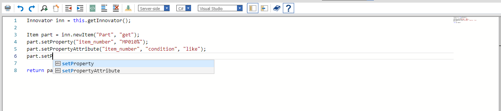
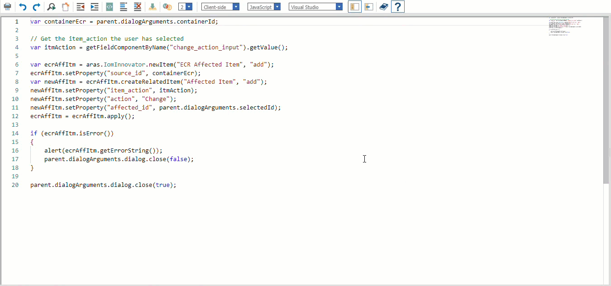

# Alternate Method Editor

[Visual Studio Code](https://code.visualstudio.com/) has quickly become one of the most popular code editors among software developers. Microsoft released the browser-based editor that powers VS Code as a standalone application called the [Monaco Editor](https://github.com/Microsoft/monaco-editor). Out-of-the-box, the Monaco Editor supports Microsoft's signature [Intellisense](https://docs.microsoft.com/en-us/visualstudio/ide/using-intellisense) as well as the option to compare two different pieces of code.

As Visual Studio Code is the preferred code editor of many members of the Aras Labs team, this project aims to integrate the Monaco Editor into an alternate Method Form to allow for an enhanced developer experience 
for writing methods inside of Aras Innovator.

## Project Details

#### Built Using:
Aras 12.0, Aras Innovator 11.0 SP15

> Please note that release 3.0+ of this product is written to support Aras Innovator 12.0 and may have unintended results if you attempt to use it with an earlier version. If you are using Aras Innovator 11.0 SP15, please be sure to download release [v2.3](https://github.com/ArasLabs/alternate-method-editor/releases/tag/v2.3).

#### History:
Release | Notes
--------|--------
[v3.1](https://github.com/ArasLabs/alternate-method-editor/releases/tag/v3.1) | Added support for 12.0 SP18
[v3.0](https://github.com/ArasLabs/alternate-method-editor/releases/tag/v3.0) | Added support for 12.0
[v2.3](https://github.com/ArasLabs/alternate-method-editor/releases/tag/v2.3) | Bug fixes
[v2.2](https://github.com/ArasLabs/alternate-method-editor/releases/tag/v2.2) | Add JS messages back to compile button
[v2.1](https://github.com/ArasLabs/alternate-method-editor/releases/tag/v2.1) | Bug fixes.
[v2.0](https://github.com/ArasLabs/alternate-method-editor/releases/tag/v2.0) | Introducing diff editor. Misc bug fixes.
[v1.2](https://github.com/ArasLabs/alternate-method-editor/releases/tag/v1.2) | Bug fixes
[v1.1](https://github.com/ArasLabs/alternate-method-editor/releases/tag/v1.1) | Initial Release. Tested on Chrome, Firefox 60 ESR, and Edge

#### Supported Aras Versions
Project | Notes
--------|--------
[v3.1](https://github.com/ArasLabs/alternate-method-editor/releases/tag/v3.1) | 12.0 SP18
[v3.0](https://github.com/ArasLabs/alternate-method-editor/releases/tag/v3.0) | 12.0
[v2.3](https://github.com/ArasLabs/alternate-method-editor/releases/tag/v2.3) | 11.0 SP15
[v2.2](https://github.com/ArasLabs/alternate-method-editor/releases/tag/v2.2) | 11.0 SP15
[v2.1](https://github.com/ArasLabs/alternate-method-editor/releases/tag/v2.1) | 11.0 SP15
[v2.0](https://github.com/ArasLabs/alternate-method-editor/releases/tag/v2.0) | 11.0 SP15
[v1.2](https://github.com/ArasLabs/alternate-method-editor/releases/tag/v1.2) | 11.0 SP15
[v1.1](https://github.com/ArasLabs/alternate-method-editor/releases/tag/v1.1) | 11.0 SP15

## Installation

#### Important!
**Always back up your code tree and database before applying an import package or code tree patch!**

### Pre-requisites

1. Aras Innovator installed (version 12.0 preferred)
2. Aras Package Import tool
3. AlternateMethodEditor import package

#### Code tree Installation

1. Backup your code tree and store the archive in a safe place
2. Navigate to your local `..\AlternateMethodEditor\` folder
3. Copy the `\Innovator\` folder
4. Paste this at the root of your install directory
    + By default this is `C:\Program Files\Aras\Innovator\`

#### Database Installation

1. Backup your database and store the BAK file in a safe place
2. Open up the Aras Package Import tool
3. Enter your login credentials and click **Login**
    * _Note: You must login as root for the package import to suceed!_
4. Enter the package name in the TargetRelease field
    * Optional: Enter a description in the Description field
5. Enter the path to your local `..\alternate-method-editor\Import\imports.mf` file in the Manifest File field
6. Select **aras.labs.AlternateMethodEditor** in the Available for Import field
7. Select Type = **Merge** and Mode = **Thorough Mode**
8. Click **Import** in the top-left corner
9. Close the Aras Package Import tool

####

You are now ready to login to Aras and try out the Alternate Method Editor

## Usage

1. Log in to Aras as admin
2. Navigate to **Administration > Methods**
3. Open any Method
4. Lock the Method
5. Begin typing into the Method Editor
6. Notice that there is now Intellisense suggesting words as you type
7. Close this Method
8. Open a Method that has multiple generations
9. Select the generation you want to compare to in the new dropdown
10. Click the new toolbar button to launch the diff editor
    * 
11. Click the same toolbar button again to switch back to the standard editor

For more information on contributing to this project, another Aras Labs project, or any Aras Community project, shoot us an email at araslabs@aras.com.

## Future Features

1. Add Intellisense for the IOM when editing C# or VB methods.

## Credits

Original Aras community project written by Christopher Gillis at Aras Corp.

Documented and published by Christopher Gillis for Aras Labs. @cgillis-aras

## Dependencies

* [Monaco Editor](https://github.com/Microsoft/monaco-editor)

## License

Aras Labs projects are published to Github under the MIT license. See the [LICENSE file](./LICENSE) for license rights and limitations.